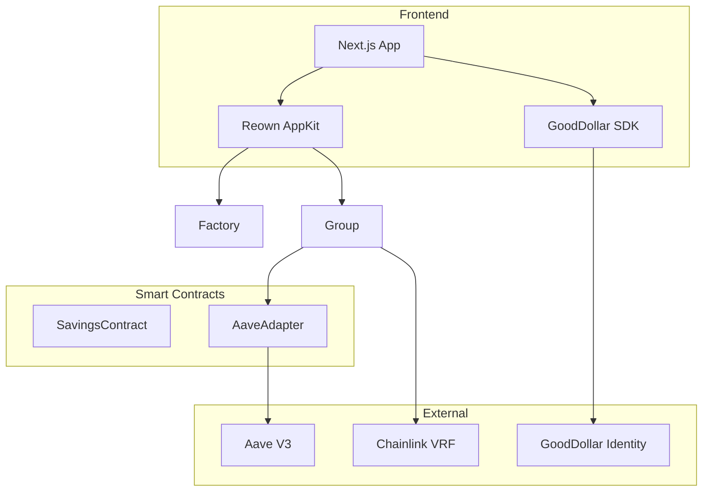
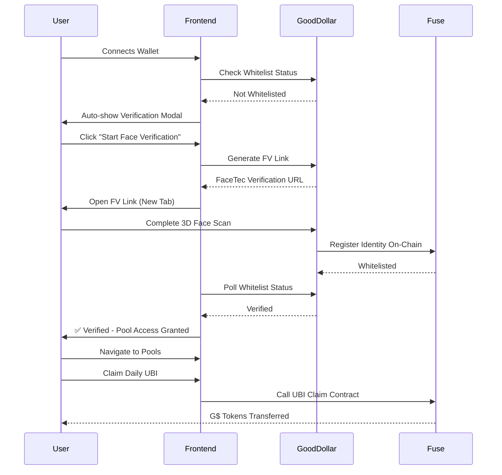

# Nectar 


[](https://opensource.org/licenses/MIT)
[](https://nextjs.org/)
[](https://www.typescriptlang.org/)
[](https://tailwindcss.com/)

**Nectar** is a decentralized savings platform where communities save together, earn yield safely, and share rewards through gamified pools. Built with Next.js 16, TypeScript, and powered by GoodDollar face verification for Sybil-resistant UBI distribution.

## Features

### Core Features
- **Collective Savings Pools** - Create or join community-driven savings groups
- **Automated Yield Generation** - Earn interest through Aave V3 integration on Celo
- **Gamified Rewards** - Winners selected via Chainlink VRF (provably fair)
- **Principal Protection** - Your deposits are always safe and withdrawable
- **GoodDollar Face Verification** - Sybil-resistant biometric proof of personhood
- **Daily UBI Token Claims** - Claim G$ Universal Basic Income tokens after verification

### User Experience
- **Responsive Design** - Optimized for mobile, tablet, and desktop
- **Beautiful UI/UX** - Modern interface with Framer Motion animations
- **Real-Time Updates** - Live pool stats and member information
- **Interactive Charts** - Visualize yield performance over time
- **Auto-Verification Modal** - Seamless verification flow on wallet connect

## Table of Contents

- [Quick Start](#quick-start)
- [Architecture](#architecture)
- [Technology Stack](#technology-stack)
- [Project Structure](#project-structure)
- [Environment Setup](#environment-setup)
- [Installation](#installation)
- [GoodDollar Integration](#gooddollar-integration)
- [Key Features](#key-features)
- [Development](#development)
- [Deployment](#deployment)
- [Contributing](#contributing)

## Quick Start

```bash
# Clone the repository
git clone https://github.com/Nectar-GD/frontend.git
cd frontend

# Install dependencies
npm install

# Set up environment variables
cp .env.example .env.local
# Edit .env.local with your credentials

# Run development server
npm run dev
```

Visit [http://localhost:3000](http://localhost:3000) to see the app.

## Architecture



## Technology Stack

### Frontend
- **[Next.js 16](https://nextjs.org/)** - React framework with App Router
- **[TypeScript 5](https://www.typescriptlang.org/)** - Type-safe development
- **[Tailwind CSS 4](https://tailwindcss.com/)** - Utility-first styling
- **[Framer Motion](https://www.framer.com/motion/)** - Smooth animations
- **[Lucide React](https://lucide.dev/)** - Beautiful icon set
- **[Sonner](https://sonner.emilkowal.ski/)** - Toast notifications

### Web3 Integration
- **[Wagmi 2.14](https://wagmi.sh/)** - React hooks for Ethereum
- **[Viem 2.45](https://viem.sh/)** - Lightweight Ethereum library
- **[Reown AppKit 1.8](https://reown.com/)** - WalletConnect integration
- **[GoodDollar SDK](https://docs.gooddollar.org/)** - Face verification & UBI claims
  - `@goodsdks/identity-sdk` (v1.0.5) - Identity verification
  - `@goodsdks/citizen-sdk` (v1.2.3) - UBI claiming

### Blockchain Infrastructure
- **[Celo Mainnet](https://celo.org/)** - Primary network for pools
- **[Chainlink VRF](https://chain.link/vrf)** - Verifiable randomness
- **[Aave V3](https://aave.com/)** - Yield generation protocol

## Project Structure

```
frontend/
├── app/                          # Next.js App Router
│   ├── pools/                    # Pools pages
│   │   ├── page.tsx              # Pools listing
│   │   └── [id]/
│   │       └── page.tsx          # Pool details
│   ├── create/
│   │   └── page.tsx              # Create pool page
│   ├── verify/
│   │   └── page.tsx              # Verification page
│   ├── page.tsx                  # Homepage
│   ├── layout.tsx                # Root layout (with AutoVerifyModal)
│   ├── globals.css               # Global styles
│   └── favicon.ico
│
├── components/                   # React Components
│   ├── home/                     # Homepage components
│   │   ├── Features.tsx
│   │   ├── Footer.tsx
│   │   ├── Header.tsx
│   │   └── Hero.tsx
│   ├── Loaders/
│   │   └── LoadingSpinner.tsx
│   ├── pools/                    # Pool components
│   │   ├── NavBar.tsx
│   │   ├── PoolActionForm.tsx
│   │   ├── PoolCard.tsx
│   │   ├── TopNav.tsx
│   │   ├── WalletRouter.tsx
│   │   └── YieldChart.tsx
│   └── verification/             # GoodDollar verification
│       ├── AutoVerifyModal.tsx   # Auto-popup on wallet connect
│       └── VerificationGuard.tsx # Protect pool access
│
├── hooks/                        # Custom React Hooks
│   ├── useCreatePool.ts          # Pool creation
│   ├── useEmergencyWithdraw.ts   # Emergency withdrawals
│   ├── useGetAllPools.ts         # Fetch all pools
│   ├── useGetPoolDetails.ts      # Pool details
│   ├── useJoinPool.ts            # Join pool
│   ├── useMyPool.ts              # User's pools
│   ├── usePoolClaim.ts           # Claim rewards
│   ├── usePoolDeposit.ts         # Deposit to pool
│   ├── usePoolMembers.ts         # Pool members
│   ├── usePoolsRegistry.ts       # Pool registry
│   ├── useVaultInfo.ts           # Vault information
│   ├── useGoodDollarClaim.ts     # GoodDollar UBI claiming
│   ├── useGoodDollarSDK.ts       # GoodDollar SDK wrapper
│   ├── useIdentity.ts            # Identity verification status
│   └── useVerificationStatus.ts  # Verification helper
│
├── config/
│   └── index.tsx                 # Wagmi configuration (Celo + Fuse)
│
├── context/
│   └── index.tsx                 # React context providers
│
├── constant/                     # Constants
│   ├── abi.json                  # Savings pool ABI
│   ├── deposit.json              # Deposit ABI
│   ├── tokenList.json            # Supported tokens
│   └── vault.json                # Vault ABI
│
├── utils/                        # Utility functions
│   ├── decodeContractError.ts
│   └── poolutils.ts
│
├── public/                       # Static assets
│   ├── banner.png
│   ├── logo.png
│   ├── hero-img.png
│   ├── harvestIcon.png
│   ├── users.png
│   └── yield-chart.png
│
├── .env.local                    # Environment variables (local)
├── .gitignore                    # Git ignore rules
├── eslint.config.mjs             # ESLint configuration
├── next.config.ts                # Next.js configuration
├── package.json                  # Dependencies
├── postcss.config.mjs            # PostCSS configuration
├── tsconfig.json                 # TypeScript configuration
└── README.md                     # This file
```

## Environment Setup

Create a `.env.local` file in the project root:

```env
# ===================================
# WALLET CONNECTION (Reown AppKit)
# ===================================
NEXT_PUBLIC_PROJECTID=your_reown_project_id

# ===================================
# SMART CONTRACTS (Celo Mainnet)
# ===================================
NEXT_PUBLIC_CONTRACT_ADDRESS=0x33D44c15d635701dFa4b671e956502747E0715Ca
```

### Getting Credentials

#### Reown Project ID
1. Visit [Reown Cloud](https://cloud.reown.com/)
2. Create new project
3. Copy Project ID

### Network Configuration

The app supports two networks:
- **Celo Mainnet (42220)** - Savings pools and Aave integration
- **Fuse Network (122)** - GoodDollar verification and UBI claims

Both are configured automatically in `config/index.tsx`.

## Installation

### Prerequisites

- **Node.js** 18.x or higher
- **npm** or **yarn**
- **Git**

### Steps

```bash
# 1. Clone repository
git clone https://github.com/Nectar-GD/frontend.git
cd frontend

# 2. Install dependencies
npm install

# 3. Install GoodDollar SDKs
npm install @goodsdks/identity-sdk@^1.0.5 @goodsdks/citizen-sdk@^1.2.3

# 4. Set up environment variables
cp .env.example .env.local
# Edit .env.local with your credentials

# 5. Run development server
npm run dev
```

Open [http://localhost:3000](http://localhost:3000) in your browser.

## GoodDollar Integration

Nectar uses **GoodDollar** for Sybil-resistant face verification and daily UBI distribution.

### Auto-Verification Flow



### Key Components

#### 1. Auto-Verification Modal
```typescript
// Automatically shows when user connects wallet (if not verified)
// Located in: components/verification/AutoVerifyModal.tsx

import { AutoVerifyModal } from '@/components/verification/AutoVerifyModal';

// In app/layout.tsx
<AutoVerifyModal />
```

#### 2. Verification Guard
```typescript
// Protects pool access - only verified users can deposit
// Located in: components/verification/VerificationGuard.tsx

import { VerificationGuard } from '@/components/verification/VerificationGuard';

<VerificationGuard>
  <DepositForm />
</VerificationGuard>
```

#### 3. Identity Hook
```typescript
// Check verification status and generate FV link
// Located in: hooks/useIdentity.ts

const {
  status,           // "loading" | "verified" | "not_verified" | "error"
  isVerified,       // boolean
  fvLink,           // Face verification URL
  generateLink,     // Function to generate FV link
  isVerifying,      // Polling for verification
} = useIdentity();
```

#### 4. UBI Claiming Hook
```typescript
// Claim daily G$ UBI tokens (on Fuse network)
// Located in: hooks/useGoodDollarClaim.ts

const {
  entitlement,      // Amount claimable (bigint)
  hasClaimed,       // Already claimed today
  nextClaimTime,    // When next claim is available
  claim,            // Function to claim UBI
  isClaiming,       // Claiming in progress
  isWhitelisted,    // Verified on GoodDollar
} = useGoodDollarClaim();
```

### Verification Features

- **Auto-trigger** on wallet connect (if not verified)
- **FaceTec 3D Liveness** - Industry-leading face verification
- **Sybil resistance** - One person = one verification
- **Daily UBI claims** - G$ tokens on Fuse network
- **Pool access control** - Only verified users can join pools
- **On-chain identity** - Stored on Fuse network
- **No backend required** - All verification checks are on-chain

### Implementation Details

```typescript
// Auto-verification in layout (app/layout.tsx)
export default function RootLayout({ children }) {
  return (
    <html lang="en">
      <body>
        <ContextProvider>
          <WalletRouter />
          <AutoVerifyModal />  {/* Auto-pops on wallet connect */}
          {children}
        </ContextProvider>
      </body>
    </html>
  );
}

// Protect pool deposits
<VerificationGuard>
  <PoolActionForm />
</VerificationGuard>

// Check verification status
const { isVerified, isLoading } = useVerificationStatus();

if (isVerified) {
  // User can join pools
}
```

### Verification Page

Users can also manually verify at `/verify`:

```typescript
// app/verify/page.tsx
- View verification status
- Start face verification
- Claim daily UBI tokens
- See next claim time
```

## Key Features

### 1. Pool Discovery
Browse all active savings pools with:
- Interactive flip cards (hover to see details)
- Pool stats (members, target, time left)
- Yield performance indicators
- Verification status badge

### 2. Pool Details
Comprehensive pool information:
- Real-time member list with addresses
- Yield performance chart (deposits + yield over time)
- Winners selection status
- Time remaining countdown
- Deposit limits and progress
- **Verification guard** on deposit form

### 3. Create Pool
Launch your own savings pool:
- Customizable parameters (duration, members, winners)
- Token selection (USDC, DAI, etc.)
- Yield adapter selection (Aave on Celo)
- **Requires verification** to create

### 4. Deposits & Withdrawals
Secure fund management:
- Min/max deposit validation
- Real-time balance checks
- Transaction confirmation
- Emergency withdrawal option
- **Verification required** for deposits

### 5. Winner Selection
Fair and transparent:
- Chainlink VRF for randomness
- Automatic distribution
- Claim interface for winners
- Winner history tracking

### 6. Daily UBI Claims
Claim G$ tokens daily:
- Automatic entitlement calculation
- 24-hour claim cycle
- Real-time countdown to next claim
- Confetti animation on successful claim
- **Verification required** to claim

## Development

### Available Scripts

```bash
# Development
npm run dev          # Start dev server (localhost:3000)
npm run build        # Build for production
npm run start        # Start production server

# Code Quality
npm run lint         # Run ESLint
```

### Adding New Features

1. **Create component** in `components/`
2. **Add hook** in `hooks/` if needed
3. **Update routes** in `app/`
4. **Test** thoroughly
5. **Update README** with new feature

### Code Style

- Use TypeScript for type safety
- Follow Tailwind utility-first approach
- Write clean, readable code
- Comment complex logic
- Use custom hooks for reusable logic

## Deployment

### Vercel (Recommended)

[](https://vercel.com/new/clone?repository-url=https://github.com/Nectar-GD/frontend)

```bash
# Install Vercel CLI
npm i -g vercel

# Deploy to preview
vercel

# Deploy to production
vercel --prod
```

### Environment Variables in Vercel

Add these in **Project Settings → Environment Variables**:

- `NEXT_PUBLIC_PROJECTID` - Reown project ID
- `NEXT_PUBLIC_CONTRACT_ADDRESS` - contract address

### Build Output

```bash
npm run build

# Output:
# .next/          # Built application
```

## Testing

### Manual Testing Checklist

**Homepage:**
- [ ] Hero section loads
- [ ] Features display correctly
- [ ] Responsive on mobile/tablet/desktop

**Wallet Connection:**
- [ ] Connect wallet button works
- [ ] WalletConnect modal appears
- [ ] Multiple wallets supported (MetaMask, Valora, etc.)
- [ ] Disconnect works properly

**GoodDollar Verification:**
- [ ] Auto-modal appears on wallet connect (if not verified)
- [ ] "Start Face Verification" generates FV link
- [ ] FV link opens in new tab
- [ ] Face scan works via FaceTec
- [ ] Verification status updates after completion
- [ ] Modal closes after successful verification
- [ ] Modal doesn't reappear for verified users
- [ ] Verification guard blocks unverified users from pools

**Verification Page (`/verify`):**
- [ ] Shows verification status correctly
- [ ] Face verification flow works
- [ ] UBI claiming interface displays
- [ ] Daily claim works (if verified)
- [ ] Countdown to next claim is accurate
- [ ] Confetti shows on successful claim

**Pools:**
- [ ] Pools list loads
- [ ] Pool cards flip on hover (desktop)
- [ ] Pool cards clickable on mobile
- [ ] Navigation to pool details works
- [ ] Verification badge shows correctly

**Pool Details:**
- [ ] All pool info displays correctly
- [ ] Yield chart renders
- [ ] Member list loads
- [ ] Pagination works (if more than 5 members)
- [ ] Deposit form validates input
- [ ] **Can't deposit without verification** ✅
- [ ] Verification guard shows properly

**Create Pool:**
- [ ] Form validates all inputs
- [ ] Token selection works
- [ ] Pool creation succeeds
- [ ] Redirects to new pool
- [ ] **Requires verification** ✅

## Contributing

We welcome contributions! Please follow these guidelines:

### How to Contribute

1. **Fork** the repository
2. **Create** a feature branch
   ```bash
   git checkout -b feature/NewFeature
   ```
3. **Commit** your changes
   ```bash
   git commit -m 'Add some New Feature'
   ```
4. **Push** to the branch
   ```bash
   git push origin feature/NewFeature
   ```
5. **Open** a Pull Request

### Development Guidelines

- Write clean, maintainable TypeScript
- Follow existing code patterns
- Add comments for complex logic
- Test your changes thoroughly
- Update documentation as needed
- Use semantic commit messages

### Reporting Bugs

Open an issue with:
- Clear description
- Steps to reproduce
- Expected vs actual behavior
- Screenshots (if applicable)
- Environment details

## Roadmap

### Phase 1 (Completed ✅)
- [x] Core savings pools functionality
- [x] Aave V3 yield integration (Celo)
- [x] Chainlink VRF for winner selection
- [x] GoodDollar face verification
- [x] Auto-verification modal on wallet connect
- [x] Daily UBI token claiming (G$ on Fuse)
- [x] Verification guards for pool access
- [x] Responsive UI/UX
- [x] Pool creation and management
- [x] Multi-network support (Celo + Fuse)

### Phase 2 (Q2 2026)
- [ ] Multi-chain deployment (Ethereum, Polygon, Arbitrum)
- [ ] Advanced pool strategies (flexible duration, recurring)
- [ ] Social features (referrals, pool sharing)
- [ ] Enhanced analytics dashboard
- [ ] Mobile app (React Native)
- [ ] Push notifications for pool events
- [ ] UBI history tracking

### Phase 3 (Q3 2026)
- [ ] DAO governance
- [ ] NFT achievements and rewards
- [ ] Lending/borrowing features
- [ ] Insurance integration
- [ ] Cross-protocol yield aggregation
- [ ] Fiat on/off ramps
- [ ] GoodDollar governance participation

## Known Issues

- GoodDollar face verification requires camera access
- Mobile wallet connections sometimes require page refresh
- Chart rendering may lag with large datasets
- Fuse network RPC may experience delays during high traffic

## FAQ

### Why do I need face verification?

Face verification ensures one person = one account, preventing Sybil attacks and enabling fair UBI distribution. It also protects savings pools from fraudulent participants.

### What is UBI?

Universal Basic Income (UBI) - verified users can claim daily G$ tokens on the Fuse network. This is separate from pool yields and is part of the GoodDollar protocol.

### Which networks do I need?

- **Celo Mainnet** - For savings pools and deposits
- **Fuse Network** - For verification and UBI claims

Your wallet must support both networks (most modern wallets do).

### Is my face data stored?

No. GoodDollar uses FaceTec for biometric verification. Your face data is never stored - only a cryptographic proof of uniqueness is recorded on-chain.

### How often can I claim UBI?

Once every 24 hours after verification.

### Can I join pools without verification?

No. Verification is required to create or join any savings pool. This ensures all participants are unique humans.

## Acknowledgments

- [GoodDollar](https://gooddollar.org/) for face verification and UBI infrastructure
- [Chainlink](https://chain.link/) for VRF infrastructure
- [Aave](https://aave.com/) for yield generation protocol
- [Celo](https://celo.org/) for the primary blockchain
- [Reown](https://reown.com/) for wallet connection infrastructure
- [OpenZeppelin](https://openzeppelin.com/) for secure smart contract libraries
- The Ethereum and Web3 community

## Support & Community

- **Website**: [nectar-celo.vercel.app](https://nectar-celo.vercel.app/)
- **GitHub**: [github.com/Nectar-GD](https://github.com/Nectar-GD)
- **GoodDollar Docs**: [docs.gooddollar.org](https://docs.gooddollar.org/)

## Related Repositories

- **Smart Contracts**: [github.com/Nectar-GD/contracts](https://github.com/Nectar-GD/contracts)

## Stats

- **Deployed Contracts**: 2 (Factory + Adapter)
- **Supported Chains**: Celo Mainnet + Fuse Network
- **Components**: 20+
- **Custom Hooks**: 18+
- **Verified Users**: Growing daily 🌱

---

<div align="center">

**Built with care by the Nectar team**

**Save Together. Earn Safely. Win Fairly. 🍯**

[Get Started](https://nectar-celo.vercel.app/) · [Report Bug](https://github.com/Nectar-GD/frontend/issues) · [Verify Now](https://nectar-celo.vercel.app/verify)

</div>